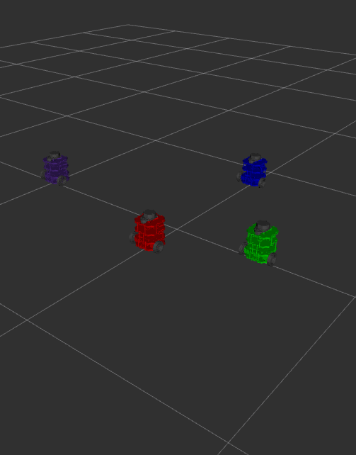

# Nuturtle  Description
URDF files for Nuturtle Rotundo
* `ros2 launch nuturtle_description load_one.launch.py` to see the robot in rviz.
* `ros2 launch nuturtle_description load_all.launch.xml` to see four copies of the robot in rviz.

* The rqt_graph when all four robots are visualized (Nodes Only, Hide Debug) is:

# Launch File Details
* `ros2 launch nuturtle_description load_one.launch.py --show-args`
  ```
  Arguments (pass arguments as '<name>:=<value>'):

    'use_jsp':
        Choose if joint_state_publisher is launched. Valid choices are: ['true', 'false']
        (default: 'true')

    'use_rviz':
        Choose if rviz is launched. Valid choices are: ['true', 'false']
        (default: 'true')

    'color':
        Change the color of the turtlebot. Valid choices are: ['purple', 'red', 'green', 'blue']
        (default: 'purple')

  ```
* `ros2 launch nuturtle_description load_all.launch.xml --show-args`
  ```
  Arguments (pass arguments as '<name>:=<value>'):

    'use_jsp':
        Choose if joint_state_publisher is launched. Valid choices are: ['true', 'false']
        (default: 'true')

    'use_rviz':
        Choose if rviz is launched. Valid choices are: ['true', 'false']
        (default: 'true')

    'color':
        Change the color of the turtlebot. Valid choices are: ['purple', 'red', 'green', 'blue']
        (default: 'purple')

  ```
  These arguments are inherited from usage for the load_one.launch.py launchfile. They can be accepted, but they don't change anything about the behavior if you include them. I am not sure if there is a way to disable them in this context.


Worked With: Liz Metzger, Marno Nel, James Oubre, Ava Zahedi, Nick Morales, Dilan Wijensinghe